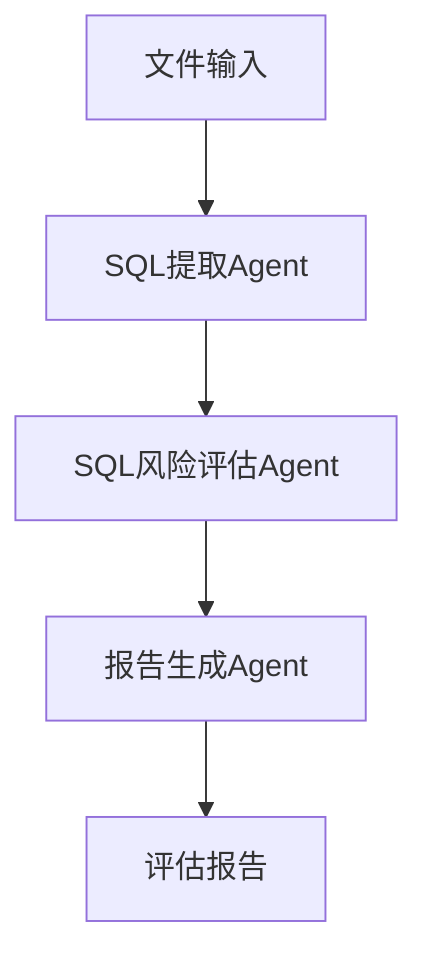

### 治理流程

整体流程，分为 3 个Agent，多个工具，

### 慢查询影响因素

| 影响因素                                | 如何判断 |
|-------------------------------------|------|
| SQL 本身可能存在的风险，比如 in、order by 没命中索引等 | AI   |
| 当前表数据量                              | 工具   |
| 表索引情况                               | 工具   |
| 执行 explain 的结果                      | 工具   |
| 未来数据的增长速度                           | 工具   |
| 目前每周的调用量                            | 工具   |

